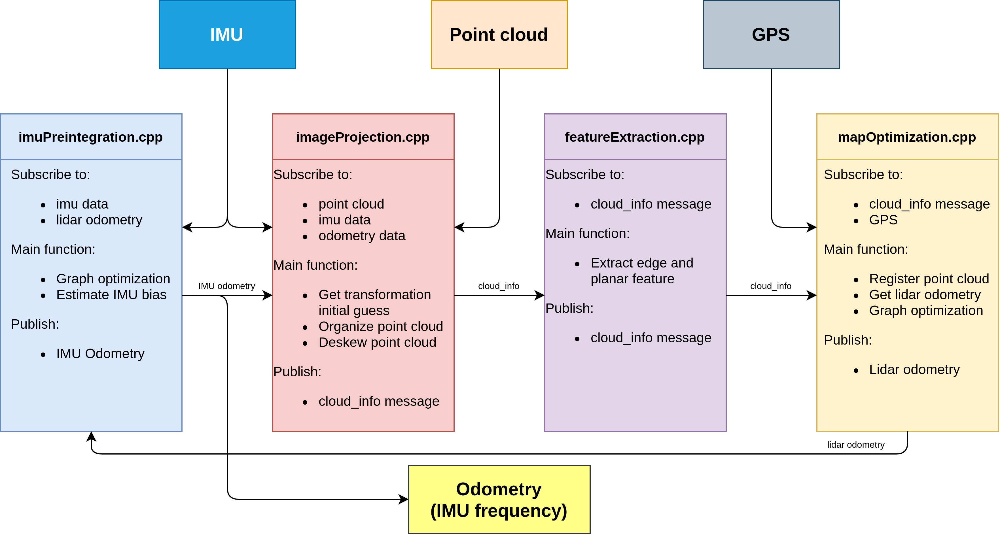
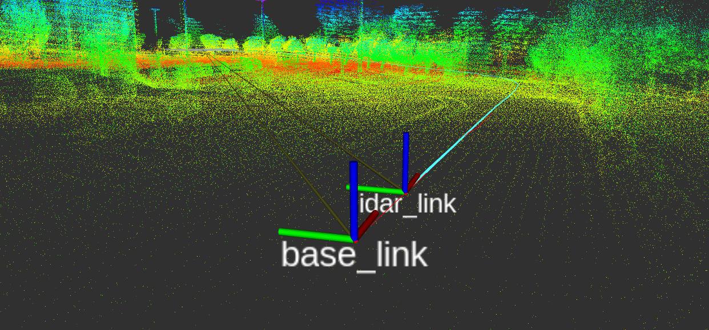
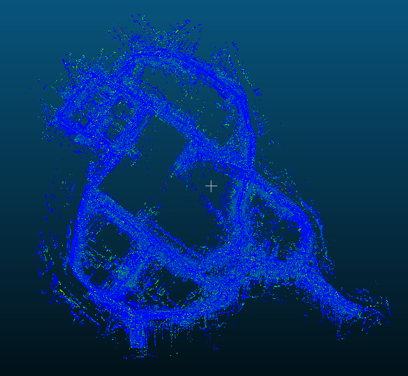

# LIO-SAM

## What is LIO-SAM?

- A framework that achieves highly accurate, real-time mobile robot trajectory estimation and map-building. It formulates lidar-inertial odometry atop a factor graph, allowing a multitude of relative and absolute measurements, including loop closures, to be incorporated from different sources as factors into the system.

## Repository Information

### Original Repository link

[https://github.com/TixiaoShan/LIO-SAM](https://github.com/TixiaoShan/LIO-SAM)

### Required Sensors

- LIDAR [Livox, Velodyne, Ouster, Robosense*]
- IMU [9-AXIS]
- GPS [OPTIONAL]

\*Robosense lidars aren't supported officially, but their Helios series can be used as Velodyne lidars.

The system architecture of LIO-SAM method described in the following diagram,
please look at the official repository for getting more information.

<figure markdown>
  { align=center width="960"}
  <figcaption>
    System Architecture of LIO-SAM
  </figcaption>
</figure>

We are using [Robosense Helios 5515](https://www.robosense.ai/en/rslidar/RS-Helios) and [CLAP B7](https://en.unicorecomm.com/assets/upload/file/CLAP-B7_Product_Brief_En.pdf) sensor on tutorial_vehicle,
so we will use these sensors for running LIO-SAM.

Additionally, LIO-SAM tested with [Applanix POS LVX](https://www.applanix.com/downloads/products/specs/POS_LVX-Datasheet.pdf) and [Hesai Pandar XT32](https://www.hesaitech.com/product/xt32/) sensor setup. Some additional information
according to the sensors will be provided in this page.

### ROS Compatibility

Since Autoware uses ROS 2 Humble currently, we will continue with ROS 2 version of LIO-SAM.

- [ROS](https://github.com/TixiaoShan/LIO-SAM/tree/master)
- [ROS 2](https://github.com/TixiaoShan/LIO-SAM/tree/ros2) (Also, it is compatible with Humble distro)

### Dependencies

ROS 2 dependencies:

- [perception-pcl](https://github.com/ros-perception/perception_pcl)
- [pcl-msgs](https://github.com/ros-perception/pcl_msgs/tree/ros2)
- [vision-opencv](https://github.com/ros-perception/vision_opencv/tree/humble)
- [xacro](https://github.com/ros/xacro/tree/ros2)

To install these dependencies, you can use this bash command in your terminal:

```bash
sudo apt install ros-humble-perception-pcl \
       ros-humble-pcl-msgs \
       ros-humble-vision-opencv \
       ros-humble-xacro
```

Other dependencies:

- [gtsam](https://gtsam.org/get_started/) (Georgia Tech Smoothing and Mapping library)

To install the gtsam, you can use this bash command in your terminal:

```bash
  # Add GTSAM-PPA
  sudo add-apt-repository ppa:borglab/gtsam-release-4.1
  sudo apt install libgtsam-dev libgtsam-unstable-dev
```

## Build & Run

### 1) Installation

In order to use and build LIO-SAM, we will create workspace for LIO-SAM:

```bash
    mkdir -p ~/lio-sam-ws/src
    cd ~/lio-sam-ws/src
    git clone -b ros2 https://github.com/TixiaoShan/LIO-SAM.git
    cd ..
    colcon build --symlink-install --cmake-args -DCMAKE_BUILD_TYPE=Release
```

### 2) Settings

After the building of LIO-SAM,
we need to record ROS 2 Bag file with including necessary topics for LIO-SAM.
The necessary topics are described in the [config file](https://github.com/leo-drive/LIO-SAM/blob/4938d3bb4423b76bf5aa22556dd755526b03a253/config/params.yaml#L4-L8) on LIO-SAM.

??? note "ROS 2 Bag example for LIO-SAM with Robosense Helios and CLAP B7"

    ```sh
    Files:             map_bag_13_09_0.db3
    Bag size:          38.4 GiB
    Storage id:        sqlite3
    Duration:          3295.326s
    Start:             Sep 13 2023 16:40:23.165 (1694612423.165)
    End:               Sep 13 2023 17:35:18.492 (1694615718.492)
    Messages:          1627025
    Topic information: Topic: /sensing/gnss/clap/ros/imu | Type: sensor_msgs/msg/Imu | Count: 329535 | Serialization Format: cdr
    Topic: /sensing/gnss/clap/ros/odometry | Type: nav_msgs/msg/Odometry | Count: 329533 | Serialization Format: cdr
    Topic: /sensing/lidar/top/pointcloud_raw | Type: sensor_msgs/msg/PointCloud2 | Count: 32953 | Serialization Format: cdr

    ```

**Note:**
We use `use_odometry` as true at [clap_b7_driver](https://github.com/Robeff-Technology/clap_b7_driver/tree/dev/autoware) for publishing GPS odometry topic from navsatfix.

Please set topics and sensor settings on `lio_sam/config/params.yaml`.
Here are some example modifications for out tutorial_vehicle.

- Topic names:

```diff
-   pointCloudTopic: "/points"
+   pointCloudTopic: "/sensing/lidar/top/pointcloud_raw"
-   imuTopic: "/imu/data"
+   imuTopic: "/sensing/gnss/clap/ros/imu"
    odomTopic: "odometry/imu"
-   gpsTopic: "odometry/gpsz"
+   gpsTopic: "/sensing/gnss/clap/ros/odometry"
```

Since we will use GPS information with Autoware,
so we need to enable `useImuHeadingInitialization` parameter.

- GPS settings:

```diff
-   useImuHeadingInitialization: false
+   useImuHeadingInitialization: true
-   useGpsElevation: false
+   useGpsElevation: true
```

We will update sensor settings also.
Since Robosense Lidars aren't officially supported,
we will set our 32-channel Robosense Helios 5515 lidar as Velodyne:

- Sensor settings:

```diff
-   sensor: ouster
+   sensor: velodyne
-   N_SCAN: 64
+   N_SCAN: 32
-   Horizon_SCAN: 512
+   Horizon_SCAN: 1800
```

After that,
we will update extrinsic transformations between Robosense Lidar and CLAP B7 GNSS/INS (IMU) system.

- Extrinsic transformation:

```diff
-   extrinsicTrans:  [ 0.0,  0.0,  0.0 ]
+   extrinsicTrans:  [-0.91, 0.0, -1.71]
-   extrinsicRot:    [-1.0,  0.0,  0.0,
-                      0.0,  1.0,  0.0,
-                      0.0,  0.0, -1.0 ]
+   extrinsicRot:    [1.0,  0.0,  0.0,
+                     0.0,  1.0,  0.0,
+                     0.0,  0.0, 1.0 ]
-   extrinsicRPY: [ 0.0,  1.0,  0.0,
-                  -1.0,  0.0,  0.0,
-                   0.0,  0.0,  1.0 ]
+   extrinsicRPY: [ 1.0,  0.0,  0.0,
+                   0.0,  1.0,  0.0,
+                   0.0,  0.0,  1.0 ]

```

!!! warning

    The mapping direction is towards to the going direction in the real world.
    If LiDAR sensor is backwards, according to the direction you are moving,
    then you need to change the extrinsicRot too.
    Unless the IMU tries to go in the wrong direction, and it may occur problems.

For example, in our Applanix POS LVX and Hesai Pandar XT32 setup, IMU direction was towards to the going direction and
LiDAR direction has 180 degree difference in Z-axis according to the IMU direction. In other words, they were facing back
to each other. The tool may need a transformation for IMU for that.

- In that situation, the calibration parameters changed as this:

```diff
-   extrinsicRot:    [-1.0,  0.0,  0.0,
-                      0.0,  1.0,  0.0,
-                      0.0,  0.0, -1.0 ]
+   extrinsicRot:    [-1.0,  0.0,  0.0,
+                     0.0,  -1.0,  0.0,
+                     0.0,   0.0,  1.0 ]
-   extrinsicRPY: [ 0.0,  1.0,  0.0,
-                  -1.0,  0.0,  0.0,
-                   0.0,  0.0,  1.0 ]
+   extrinsicRPY: [ -1.0,  0.0,  0.0,
+                    0.0, -1.0,  0.0,
+                    0.0,  0.0,  1.0 ]
```

- In the end, we got this transform visualization in RViz:

<figure markdown>
  { align=center width="512"}
  <figcaption>
    Transform Visualization of Applanix POS LVX and Hesai Pandar XT32 in RViz
  </figcaption>
</figure>

Now, we are ready to create a map for Autoware.

### 3) Usage

If you are set configurations and create bag file for LIO-SAM, you can launch LIO-SAM with:

```bash
ros2 launch lio_sam run.launch.py
```

The rviz2 screen will be open, then you can play your bag file:

```bash
ros2 bag play <YOUR-BAG-FILE>
```

If the mapping process is finished, you can save map with calling this service:

```bash
ros2 service call /lio_sam/save_map lio_sam/srv/SaveMap "{resolution: 0.2, destination: <YOUR-MAP-DIRECTORY>}"
```

Here is the video for demonstration of LIO-SAM mapping in our campus environment:


The output map format is local UTM,
we will change local UTM map to MGRS format for tutorial_vehicle.
Also, if you want change UTM to MGRS for autoware,
please follow [convert-utm-to-mgrs-map](../../converting-utm-to-mgrs-map) page.

## Example Result

<figure markdown>
  { align=center width="512"}
  <figcaption>
    Sample Map Output for our Campus Environment
  </figcaption>
</figure>

## Paper

Thank you for citing LIO-SAM (IROS-2020) if you use any of this code.

```bash
@inproceedings{liosam2020shan,
  title={LIO-SAM: Tightly-coupled Lidar Inertial Odometry via Smoothing and Mapping},
  author={Shan, Tixiao and Englot, Brendan and Meyers, Drew and Wang, Wei and Ratti, Carlo and Rus Daniela},
  booktitle={IEEE/RSJ International Conference on Intelligent Robots and Systems (IROS)},
  pages={5135-5142},
  year={2020},
  organization={IEEE}
}
```

Part of the code is adapted from [LeGO-LOAM](https://github.com/RobustFieldAutonomyLab/LeGO-LOAM).

```bash
@inproceedings{legoloam2018shan,
  title={LeGO-LOAM: Lightweight and Ground-Optimized Lidar Odometry and Mapping on Variable Terrain},
  author={Shan, Tixiao and Englot, Brendan},
  booktitle={IEEE/RSJ International Conference on Intelligent Robots and Systems (IROS)},
  pages={4758-4765},
  year={2018},
  organization={IEEE}
}
```

## Acknowledgements

- LIO-SAM is based on LOAM (J. Zhang and S. Singh. LOAM: Lidar Odometry and Mapping in Real-time).